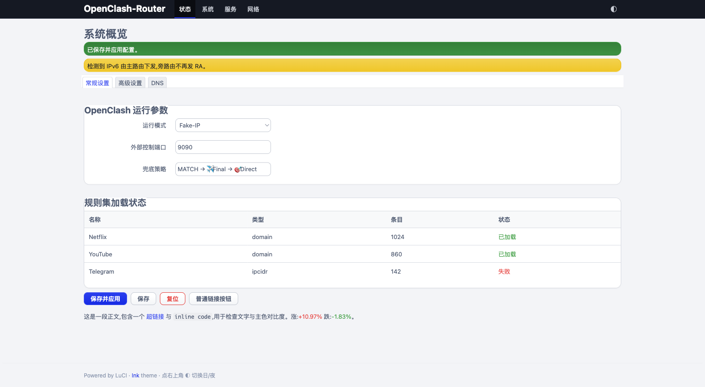
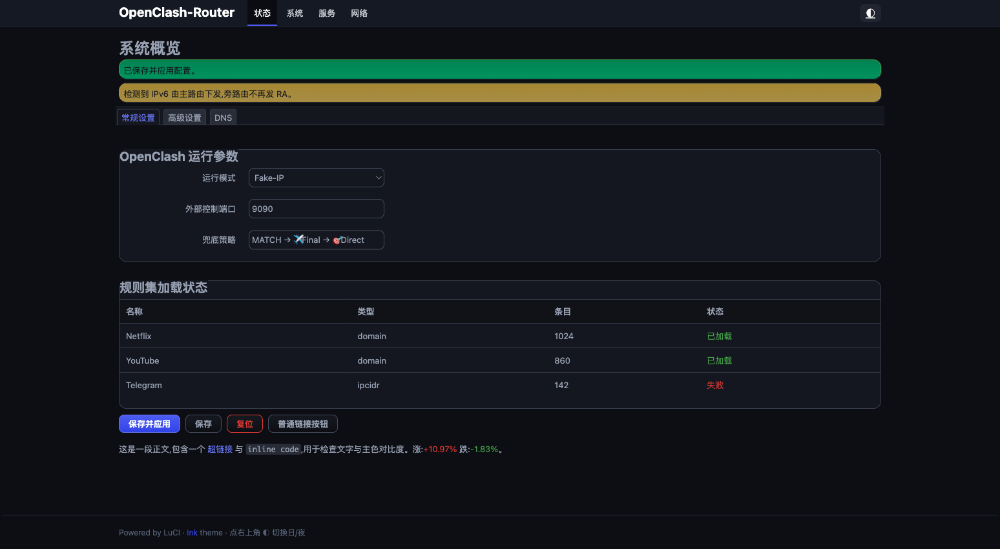

# luci-theme-ink

一款 **PanWatch 风格**(靛蓝 / 深藏蓝)的 OpenWrt LuCI 主题,支持**日间 / 暗黑一键切换**。基于官方 `luci-theme-bootstrap` 的 ucode 模板引擎二次开发,仅重写外观层(配色 / 圆角 / 字体 / 顶栏 / 卡片),不改任何后端逻辑。

> 设计语言取自个人项目 PanWatch:冷灰白底 + 纯白卡片(日间)/ 深藏蓝底 + 上浮卡片(暗黑),靛蓝主色 `hsl(234 85% 55%)`,12px 圆角,系统字体,红涨绿跌语义色。

| 日间 | 暗黑 |
|---|---|
|  |  |

## 特性

- 🎨 PanWatch 同款视觉:靛蓝主色、深藏蓝暗色、柔和圆角与阴影
- 🌓 **日间 / 暗黑切换**:顶栏 ◐ 按钮手动切换,并记忆选择(localStorage);未选择时跟随系统 `prefers-color-scheme`
- 🧩 基于官方 ucode 主题引擎(适配现代 LuCI,如 OpenWrt 24.10 / 25.12)
- 📦 CI 自动用 OpenWrt SDK 打包(`.apk`),打 tag 自动发 Release

## 目录结构

```
luci-theme-ink/                  # 主题包(feed 中的 package)
├── Makefile                     # include $(TOPDIR)/feeds/luci/luci.mk
├── htdocs/luci-static/ink/      # cascade.css(bootstrap 引擎 + Ink 覆盖层)、mobile.css、logo.svg
├── ucode/template/themes/ink/   # header.ut / footer.ut / sysauth.ut
└── root/etc/uci-defaults/30_luci-theme-ink   # 注册主题
preview/index.html               # 本地预览(浏览器直接打开,免路由器)
.github/workflows/build.yml      # 打包流水线
```

## 本地预览(不需要路由器)

直接用浏览器打开 `preview/index.html` —— 它加载真实的 `cascade.css`,仿 LuCI 页面结构(顶栏 / 表单卡片 / 表格 / 标签页 / 按钮 / 提示),右上角 ◐ 可切换日 / 夜。改完 CSS 刷新即见效。

## 安装

### A. 从 Release 安装(推荐,apk 系统如 25.12)

```sh
# 下载 release 里的 luci-theme-ink_*.apk 后:
apk add --allow-untrusted ./luci-theme-ink_*.apk
```

安装脚本会自动注册并设为默认主题。到 **系统 → 系统 → 语言和界面风格** 里也能切换。

### B. 手动落盘(用于快速测试 / 免编译)

把主题文件放到运行中的路由器对应路径,再注册:

```sh
# 在路由器上(或从本机 scp 过去)
cp -r luci-theme-ink/htdocs/luci-static/ink /www/luci-static/ink
mkdir -p /usr/share/ucode/template/themes/ink
cp luci-theme-ink/ucode/template/themes/ink/*.ut /usr/share/ucode/template/themes/ink/
uci set luci.themes.Ink=/luci-static/ink
uci set luci.main.mediaurlbase=/luci-static/ink
uci commit luci
```

> 提示:模板落盘路径以你系统里 `luci-theme-bootstrap` 的 `*.ut` 实际所在目录为准(不同版本可能是 `/usr/share/ucode/template/themes/…`),照它放即可。建议先在**一次性测试 VM**上验证。

## 构建

CI 会自动构建;本地手动构建可用 OpenWrt SDK:

```sh
# 在 SDK 根目录
ln -s $(pwd)/../luci-theme-ink/luci-theme-ink package/luci-theme-ink
./scripts/feeds update -a && ./scripts/feeds install luci-base
make defconfig
make package/luci-theme-ink/compile V=s
# 产物在 bin/packages/<arch>/ink/luci-theme-ink_*.apk
```

## 致谢

- [openwrt/luci](https://github.com/openwrt/luci) — `luci-theme-bootstrap`(Apache-2.0),本主题的模板与 CSS 引擎基础
- 设计语言来自个人项目 **PanWatch**

## License

[Apache-2.0](./LICENSE)
